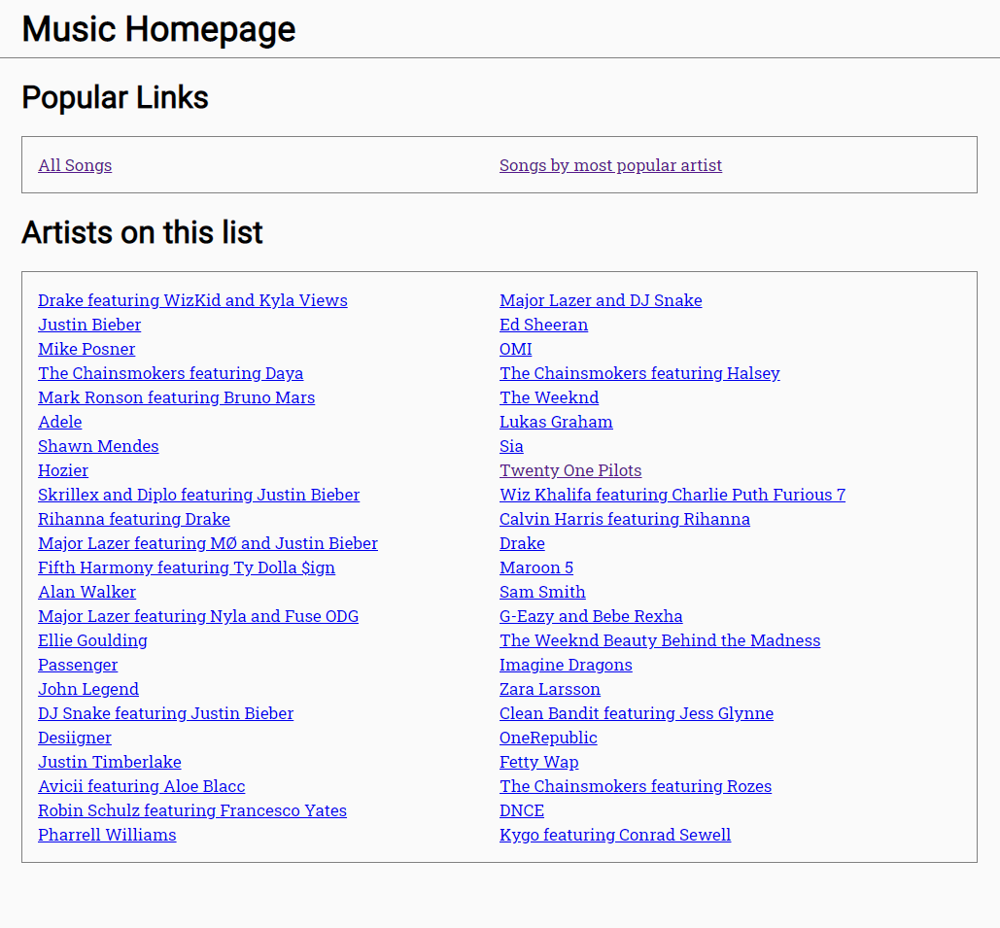

# Node.Js - URL Params Workshop

## 🦊 Pre-lecture

⏲️ _Estimated time required: 30 minutes._

- https://www.sitepoint.com/get-url-parameters-with-javascript/

---

## 🦉 Lecture

- [lecture-0-review.md](__lecture/lecture-0-review.md)
- [lecture-1-url-params.md](__lecture/lecture-1-url-params.md)

---

## Setup

There are many ways to set up a full-stack development environment. For the Node module, we will follow this set up provided in this repository.

This repository contains a frontend and a backend folder. This means that each folder is contains a complete environment (`package.json`, `/node_modules`) and are completely independent. You cannot reference code from one environment in the other environment.

Generally speaking, the frontend will query the backend via calls to the server endpoints.

### File Structure

```
├── __lecture
├── __workshop
├── backend
    ├── node_modules (where all external dependencies are saved)
    |   ├── ...
    |   └── ...
    ├── server.js
    └── yarn.lock ("locks" the dependency versions)
├── frontend
    ├── public
    ├── src
    ├── node_modules (where all external dependencies are saved)
    |   ├── ...
    |   └── ...
    ├── package.json (where we keep a record of the app setup)
    └── yarn.lock ("locks" the dependency versions)
├── .gitignore
├── .prettierrc
└── README.md (this file)
```

### The Frontend

1. Open a terminal in VS Code
2. Type `cd frontend`
3. Type `yarn install`

Use `yarn dev:frontend` to start the frontend dev environment.

### The Backend

1. Open _another_ terminal in VS Code
2. Type `cd backend`
3. Type `yarn install`

Use `yarn dev:backend` to start the backend dev environment.


---

## ⚡ Exercises

For this part of the workshop, you won't use the frontend at all. Follow the instructions, and once you finish exercise 5, you will have a functioning backend that will just work with the frontend.

### Exercise 1 - `/top50` endpoint

Open this exercise file: [exercise-1.md](__workshop/exercise-1.md)

### Exercise 2 - `GET`ting a specific song

Open this exercise file: [exercise-2.md](__workshop/exercise-2.md)

### Exercise 3 - `GET`ting songs by a specific artist

Open this exercise file: [exercise-3.md](__workshop/exercise-3.md)

### Exercise 4 - The Most popular artist is...

Open this exercise file: [exercise-4.md](__workshop/exercise-4.md)

### Exercise 5 - Array of Artists

Open this exercise file: [exercise-5.md](__workshop/exercise-5.md)

---

<center>🟡 - Minimally complete workshop (75%) - 🟡</center>

---

## Upgrading the Frontend

If you start up the FE and go to `http://localhost:3000`, you should have a functional app. It still needs a little love, but overall it should work.

This is what you see on the homepage.



Take a look through the `frontend` folder at the all of the code that is already written. 

There are still a few components to create to get a fully functional site.

### Exercise 6 - Render the top 50 songs

Open this exercise file: [exercise-6.md](__workshop/exercise-6.md)

### Exercise 7 - Render the songs by the most popular artist

Open this exercise file: [exercise-7.md](__workshop/exercise-7.md)

### Exercise 8 - Render the songs on each artist's page

Open this exercise file: [exercise-8.md](__workshop/exercise-8.md)

---

<center>🟢 - Complete workshop (100%) - 🟢</center>

---
